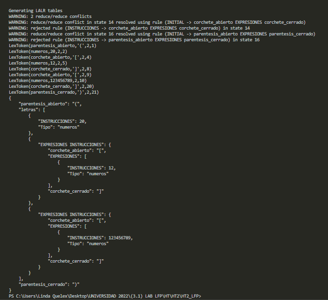
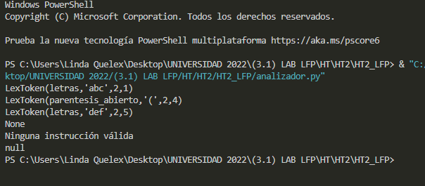
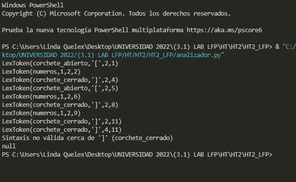

# HOJA DE TRABAJO 2 
* UNIVERSIDAD DE SAN CARLOS DE GUATEMALA 
* Laboratorio de Lenguajes Formales de Programación 
* Linda Madelin Fabiola Quelex Sep
* 201403745

# 1. Gramática

## 1.1. Alfabeto
### 1.1.1. Símbolos terminales
#### 1.1.1.1. Expresiones regulares

| Token              |  Patrón   |
| ------------------ | :-------: |
| parentesis_abierto |     (     |
| parentesis_cerrado |     )     |
| corchete_abierto   |     [     |
| corchete_cerrado   |     ]     |
| letras             | [a-zA-Z]+ |
| numeros            |  [0-9]+   |


### 1.1.2. Símbolos no terminales

| Token       | Descripción          |
| ----------- | -------------------- |
| EXPRESSIONS | Lista de expresiones |


## 1.2. Sintáxis

### 1.2.1. Precedencia

| Precedencia | Operador   | asociatividad |
| :---------: | ---------- | ------------- |
|      2      | agrupación | no aplica     |
|      1      | arreglo    | izq           |


### 1.2.2. Producciones
```
Símbolo inicial = INICIO

INITIAL : corchete_abierto EXPRESIONES corchete_cerrado
       | parentesis_abierto EXPRESIONES parentesis_cerrado
       | EXPRESIONES


EXPRESIONES : EXPRESIONES INSTRUCCIONES
           | INSTRUCCIONES


INSTRUCCIONES : numeros
         | letras
         | corchete_abierto EXPRESIONES corchete_cerrado
         | parentesis_abierto EXPRESIONES parentesis_cerrado

```

# 2. Código
```
from ply.ply.yacc import yacc
from ply.ply.lex import lex


# ANÁLISIS LÉXICO
def getColumn(t):
  line_start = INPUT.rfind('\n', 0, t.lexpos) + 1
  return (t.lexpos-line_start)+1

tokens=(
    'parentesis_abierto',
    'parentesis_cerrado',
    'corchete_abierto',
    'corchete_cerrado',
    'letras',
    'numeros'
    )

t_parentesis_abierto=r'\('
t_parentesis_cerrado=r'\)'
t_corchete_abierto=r'\['
t_corchete_cerrado=r'\]'

# Lexemas ignorados
t_ignore = ' \t\r'

"""
  t:
    - lineno: numero de linea
    - value: valor del lexema
    - type: nombre del token
"""

#Expresiones regulares para AFD
def t_numeros(t):
    r'\d+'
    t.value=int(t.value)
    return t

def t_letras(t):
    r'[a-zA-Z]+'
    t.type='letras'
    return t

def t_newline(t):
  r'\n+'
  t.lexer.lineno+=len(t.value)

def t_error(t):
  print(t.lineno, getColumn(t), f"No se pudo reconocer el lexema '{t.value}'")
  t.lexer.skip(1)


def p_INITIAL(p):
    '''
    INITIAL : corchete_abierto EXPRESIONES corchete_cerrado
            | parentesis_abierto EXPRESIONES parentesis_cerrado
            | EXPRESIONES
    '''
    if len(p) == 4:
        if p[1] == '[':
            p[0] = {'corchete_abierto': p[1],
                    'EXPRESIONES': p[2], 'corchete_cerrado': p[3]}
        elif p[1] == '(':
            p[0] = {'parentesis_abierto': p[1],
                    'letras': p[2], 'parentesis_cerrado': p[3]}
    else:
        p[0] = p[1]


def p_EXPRESIONES(p):
    '''
    EXPRESIONES : EXPRESIONES INSTRUCCIONES
           | INSTRUCCIONES
    '''
    if len(p) == 3:
        p[0] = p[1]
        p[0].append({'EXPRESIONES INSTRUCCIONES': p[2]})
    else:
        p[0] = [p[1]]


def p_INSTRUCCIONES(p):
    '''
    INSTRUCCIONES : numeros
         | letras
         | corchete_abierto EXPRESIONES corchete_cerrado
         | parentesis_abierto EXPRESIONES parentesis_cerrado
    '''
    if len(p) == 4:
        if p[1] == '[':
            p[0] = {'corchete_abierto': p[1], 'EXPRESIONES': p[2], 'corchete_cerrado': p[3]}
        elif p[1] == '(':
            p[0] = {'parentesis_abierto': p[1],
                    'EXPRESIONES': p[2], 'parentesis_cerrado': p[3]}
    else:
        p[0] = {"INSTRUCCIONES": p[1], 'Tipo': p.slice[1].type}


def p_error(p):
    print(p)
    if p:
        print(f"Sintaxis no válida cerca de '{p.value}' ({p.type})")
    else:
        print("Ninguna instrucción válida")


lexer = lex()

parser = yacc(start='INITIAL')


INPUT = '''
(20[012][0123456789])
'''

lexer.input(INPUT)

for tok in lexer:
    print(tok)

ast = parser.parse(INPUT, lexer)
import json
print(json.dumps(ast, indent=4, sort_keys=False))


```


# 3. Salidas

## 3.1. Salida para: (20[012][0123456789])
<p></p>

## 3.2. Salida para: abc(def
<p></p>

## 3.3. Salida para: [01][01]01]
<p></p>


